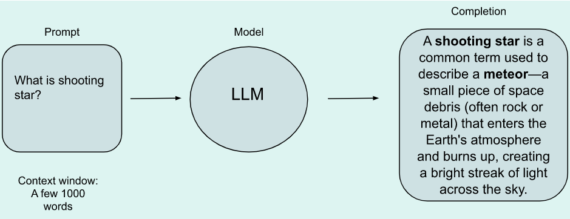

# Large_Language_Models
#Introduction
Text generation before transformer, limited to RNN. RNN has a problem because it is limited to some few words to predcit new words and in some cases limiting to only few words was not enough for prediction. Model needs to have understanding of the whole sentence or even whole document. The novel approaced called transformer unlock the progress in generativeAI. It can be scaled efficiently to use multi-core GPUs, it can parallel process input input and make using of much larger training data, most importantly it can pay attention to meaning of the word its processing. 
The power of the transformer architecture is learning the relevance and context of all of the words in a sentence. It consider every other word in a sentence not just neighbor words. With applyng attention weight that model learns the relevance of each word to each other word no matter where there are in the input.
How can we learned these attention weights? these attention weights learned during LLM training.
attention map: it can illustrate the attention weights between each word and every other word.
 
we can see that the connection between word student and exam is stonger than conction between studnet and other words. It is called self attention. 

## Different types of transformer models:
### Encoder models:
Input and output sequence has the same length.
Popular model for encoder only model is BERT.
Encoder model outputs numerical representation of each word. It will give sequance number per word. This numerical representation called feature vector or feature tensor. The dimension of vectors are defined by the architecture of the model. For the BERTs model it is 768. This representation contains value of the word but contextcualized. Each word in a sequence affects other words in the sentence. This vector representation of a word hold the meaning of a word within the text. It is related to self attention mecahnism.
Encoder models are well suited for tasks requiring an understanding of the full sentence, such as:
-- Extracting meaningful information.
-- Sequance classification. An example of this part can be sentiment analysis.
-- Question answering.
-- Masked Language Modeling (MLM). Encoder with bi-directional context are good at guessing words in the middle of senetence. Sometimes without having information in the right side of a word, it is hard to figure out the missing word. Therefore, it requires semantic understanding as well as syntactic understanding.
-- Natural language understanding.

### Decoder model:
Popular decoder model include GPT models like Bloom, Jurassic, Lama.
What is the difference between decoder and encoder;  
Decoder can see the words on their left side and the words in its right side are hidden. (unidirectional)
In another word, the decoder consider masked self attention mechanism. while encoder consider self attention mechanism.
Use cases of decoder:
-- Causal tasks such as generation sequance.
-- Natural language generation.

### Encoder-Decoder model:
Input and output sequence can have different length.
Popular model in this group are T5 and BART.
Some use cases:
-- Chatbots
-- Machine Translation
-- Text summary
-- Image captioning

# Basic structure:
 -Prompt: text passed to the LLM model. 
 -Context window: space or memory that is avilable to the prompt. 
 -Completion: output of the LLM model. It consists of prompt and generated text. 
 -Infereance: act of using the model to generate text. 
 
# Prompt Engineering
To improve the result that produced by the model, we can revise the language that promp has been written and make the model to produce the result that we want. This work to develop and improve the prompt is called promp engineering.
One powerful strategy is providing some examples inside the prompt. Providing examples inside the context window is called in-context learning.
## In-context Learning (ICL)-zero shot inference
In zero-shot classification, no examples are provided in the prompt, and the model must complete the task without being specifically trained on it. Larger LLM models with more trainable parameters or layers could produce better result compare to smaller models. 

## In-context Learning (ICL)-One shot inference
Providing an example within the prompt will improve the performance. Somrimes, one examples is not enough for the model to figure out what it wants to do.

## In-context Learning (ICL)-Few shot inference
consdier more than example inside the prompt to prodcue better result.'

To produce good result, we can engineer the prompt and test which one produce give us better reslut, but there is a limit in context window for the prompt. If you find your model does not performe well,ebven with five or six examples consider fine tuning of the model.
What is fine tunning?
consider additional training on the model with new data to make it more capable of the new task.
Models with more parameters capable more of understanding the language.
Smaller model are good at small number of tasks.

# Configuration parameter

These parameters are invoked at inference time. Such as maximum number of tokens in the completion and how creative the p=output is. 
after softmax transformer, we can have a probablity for all words in the dictionary.
One popular approach to generate next word is greedy decoding.
Greedy decoding is good for short generation but it is susceptible to repeated words or sequance of words.
to produce more natural words, we need to used naother approach which is called random sampling. This method introduces some variablity.
## Top k values
This approach allow the model to choose k tokens with highest probalblity.then the model select from these options by probablity distribution.
## top p sampling

